<div align="center">

# goCar

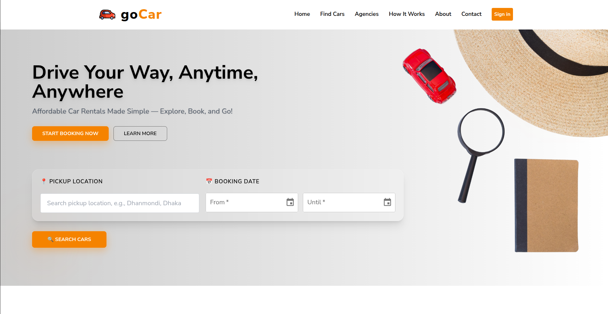

**A multi-role car rental web platform for Bangladesh**

Connecting customers, rental agencies, and drivers on a single platform — with real-time booking, damage tracking, payments, and role-specific dashboards.

[](#)
[](#)
[](#)

</div>

---

## Table of Contents

- [Project Overview](#project-overview)
- [Live Demo](#live-demo)
- [Tech Stack](#tech-stack)
- [Project Structure](#project-structure)
- [Getting Started](#getting-started)
- [Roles & Documentation](#roles--documentation)
- [Key Features](#key-features)
- [Routing Architecture](#routing-architecture)
- [State Management](#state-management)
- [Authentication](#authentication)
- [Screenshots](#screenshots)

---

## 🚗 Project Overview

goCar is a full-stack, multi-role car rental web platform designed to streamline
the vehicle rental process for agencies, drivers, and customers in Bangladesh.
Traditional car rental businesses rely heavily on manual coordination — phone calls,
paper records, and cash-only transactions — leading to inefficiencies, poor
transparency, and a frustrating experience for all parties involved. goCar solves
this by digitizing the entire rental lifecycle from booking to return.

---

### 👥 Target Users

| Role | Description |
|---|---|
| 🏢 **Agency** | Car rental businesses that manage their vehicle fleet, onboard and oversee drivers, handle damage reports, and monitor earnings and reviews through a dedicated dashboard. |
| 🧑‍✈️ **Driver** | Agency-assigned drivers who manage their trip schedule, track earnings, maintain their profile and license information, and view customer feedback. |
| 👤 **Customer** | End users who search for available vehicles, choose between self-drive or driver-assisted rentals, make short or extended bookings, complete payments, and submit reviews after their rental. |

---

### 💡 Key Value Proposition

- **Self-Drive or Chauffeured** — Customers can choose to rent a vehicle
  independently or book with an agency-assigned driver, giving full flexibility
  based on preference, occasion, or driving confidence.

- **Long-Term Rental Support** — Unlike typical ride-hailing apps, goCar is
  built for extended rental periods — whether it's a single day, a week-long
  road trip, or a month-long corporate arrangement — with pricing and booking
  logistics designed to handle it all.

- **For Agencies** — A centralized dashboard to manage fleets, drivers, bookings,
  damage tracking, and revenue analytics — replacing spreadsheets and phone-based
  coordination entirely.

- **For Drivers** — A dedicated portal to stay updated on assigned trips, track
  earnings over time, and maintain a professional profile visible to agencies
  and customers.

- **For Customers** — A transparent, self-service booking experience with clear
  pricing, driver availability, real-time booking status, and post-trip review
  capability.

- **For Everyone** — Role-based access ensures each user sees only what is
  relevant to them, backed by secure Firebase Authentication and a robust
  PostgreSQL data model.

## Live Demo

> **Deployed URL:** `https://go-car.example.com` *(update with actual URL)*

### Demo Accounts

| Role | Email | Password |
|---|---|---|
| Customer | `nayeem99@yopmail.com` | `Asd@1234` |
| Agency | `nayeem.agency@yopmail.com` | `Asd@1234` |
| Driver | `nayeem.driver@yopmail.com` | `Asd@1234` |
| Admin | `admin.gocar@yopmail.com` | `Asd@1234` |

## Tech Stack

| Category | Technology |
|---|---|
| Framework | React 18.3 + Vite 6 |
| Routing | React Router DOM 7 |
| State Management | Redux Toolkit 2.8 + React Query 5.62 |
| UI Components | Material-UI (MUI) 6 + Tailwind CSS 3.4 |
| Forms | React Hook Form 7 + Zod 4 |
| Maps | Leaflet 1.9 + React Leaflet 4.2 |
| Date/Time | MUI X Date Pickers 7 + date-fns 4 |
| Animations | Framer Motion 12 |
| Authentication | Firebase 11 |
| HTTP Client | Axios 1.7 |
| Icons | Lucide React + React Icons 5.3 |
| PDF Export | jsPDF 4.2 + jsPDF AutoTable 5 |
| Notifications | React Hot Toast 2.4 |

---

## Project Structure

```
GoCar/
├── index.html
├── vite.config.js
├── tailwind.config.js
├── src/
│   ├── main.jsx              # App entry point
│   ├── Root.jsx              # Root layout (Navbar + Footer)
│   ├── assets/               # Images, icons, brand logos
│   ├── components/           # Shared reusable components
│   │   ├── address/          # Address search + interactive map selector
│   │   ├── Cart/             # Favourite cars cart
│   │   ├── dateTime/         # Date/time picker
│   │   ├── payment/          # Payment success/failed pages
│   │   ├── Navbar.jsx
│   │   ├── Footer.jsx
│   │   ├── NotificationMenu.jsx
│   │   ├── ViewDetails.jsx
│   │   └── Theme.jsx
│   ├── dashboard/            # Role-based dashboards
│   │   ├── user/             # User dashboard pages
│   │   ├── agency/           # Agency dashboard pages
│   │   ├── driver/           # Driver dashboard pages
│   │   ├── admin/            # Admin dashboard pages
│   │   ├── shared/           # Shared dashboard components (notifications, reviews)
│   │   └── DashBoardLayout.jsx
│   ├── pages/                # Public-facing pages
│   │   ├── home/             # Home page + sections
│   │   ├── search/           # Browse + filter + map search
│   │   ├── booking/          # Booking flow
│   │   ├── agency/           # Agency listing + detail
│   │   ├── all_brands/       # Brand showcase
│   │   ├── how-it-works/
│   │   ├── about/
│   │   ├── contact/
│   │   └── sign_up/          # Multi-step signup (user/agency/driver)
│   ├── firebase/             # Firebase configuration
│   ├── hooks/                # Custom React hooks
│   ├── redux/                # Redux slices + store
│   ├── routes/               # Route definitions
│   └── private/              # PrivateRoute + RoleRoute guards
└── docs/
    ├── USER.md               # User role documentation
    ├── AGENCY.md             # Agency role documentation
    ├── DRIVER.md             # Driver role documentation
    └── ADMIN.md              # Admin role documentation
```

---

## Getting Started

```bash
# Install dependencies
npm install

# Start development server
npm run dev
```

The app runs at `http://localhost:5173` by default.

```bash
npm run build      # Production build
npm run preview    # Preview production build
npm run lint       # Run ESLint
```

---

## Roles & Documentation

Each role has a dedicated documentation file with its routes, features, and screenshots:

| Role | Documentation |
|---|---|
| User | [docs/USER.md](docs/USER.md) |
| Agency | [docs/AGENCY.md](docs/AGENCY.md) |
| Driver | [docs/DRIVER.md](docs/DRIVER.md) |
| Admin | [docs/ADMIN.md](docs/ADMIN.md) |

---

## Key Features

### Public
- Browse cars and motorbikes by location
- Interactive map-based location selection (Leaflet)
- Agency listings and detail pages
- Multi-step registration for each role
- How It Works, About, Contact pages

### Booking Flow
- Date/time selection with availability check
- Optional driver assignment
- Multiple payment methods (bKash, Nagad, Rocket, Card, Cash via SSLCommerz)
- Booking confirmation and receipt

### Damage & Return System
- Pickup condition recording (fuel level, odometer, photos)
- Return condition recording with auto charge calculation
- Damage report submission with photo evidence
- Severity tracking (minor / moderate / severe)

### Reviews & Ratings
- Post-booking reviews for vehicles, drivers, and agencies
- Aggregate ratings displayed on listings

### Real-Time Notifications
- Per-role notification feeds with read/unread tracking

---

## Routing Architecture

Routes are split into two files:

| File | Purpose |
|---|---|
| `src/routes/Routes.jsx` | Public pages (home, search, booking, sign up/in) |
| `src/routes/DashboardRoutes.jsx` | Protected dashboard routes per role |

Route guards:
- **PrivateRoute** — redirects unauthenticated users to sign-in
- **RoleRoute** — restricts access by `allowedRoles` array

---

## State Management

| Concern | Solution |
|---|---|
| Auth state | Firebase + Context API |
| Sign-up forms (multi-step) | Redux Toolkit slices |
| Server data (bookings, vehicles, etc.) | React Query (TanStack) |
| UI state | Local component state |

**Redux slices:**
- `userSignUpSlice` — user registration form state
- `driverSignupSlice` — driver registration form state
- `agencySignupSlice` — agency registration form state

---

## Authentication

Firebase handles authentication (email/password). On login, the user role is fetched from the backend and stored in context. Role-based route guards enforce access at the routing level.

Signup flows are multi-step, with separate flows for each role:
- `/sign-up` — User
- `/sign-up/agency` — Agency
- `/sign-up/driver` — Driver

---

## Screenshots

### Home Page

| Banner | Car Types |
|---|---|
| 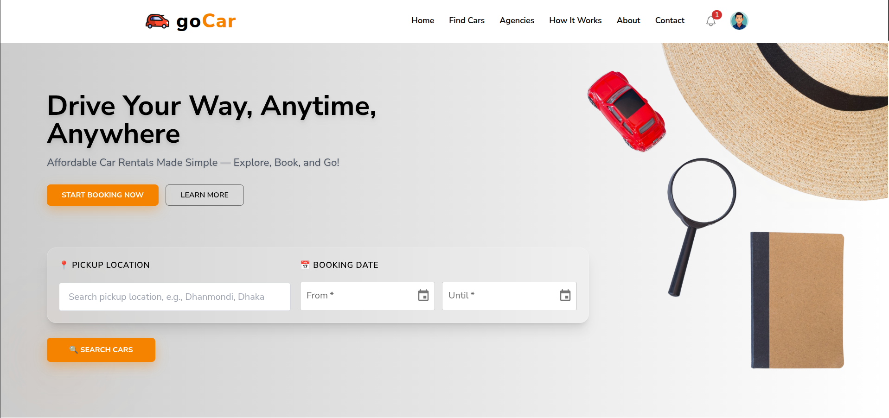 | 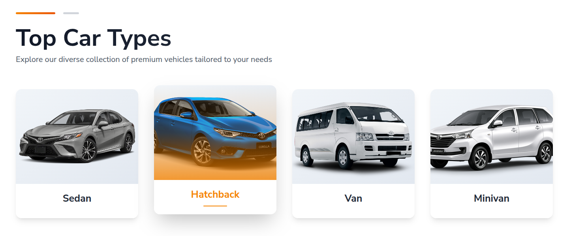 |

| Car Types | FQA |
|---|---|
| 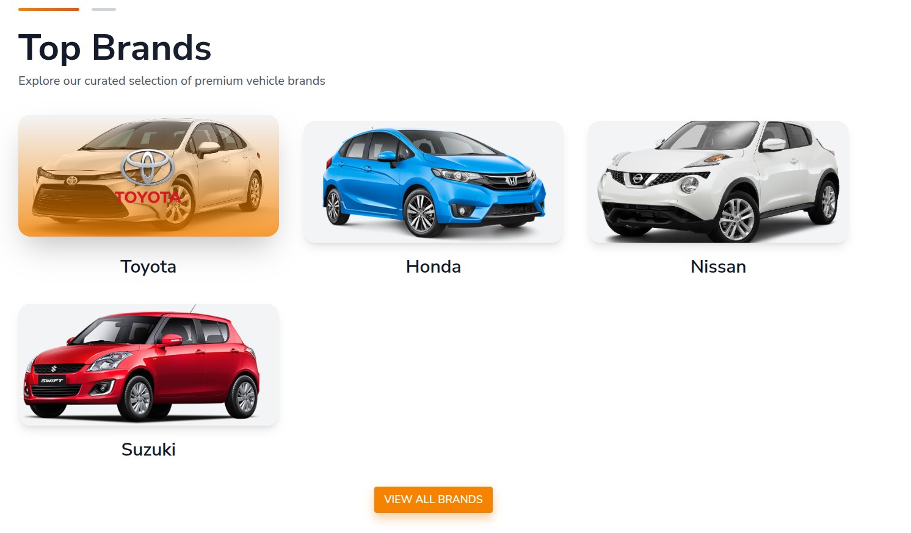 | 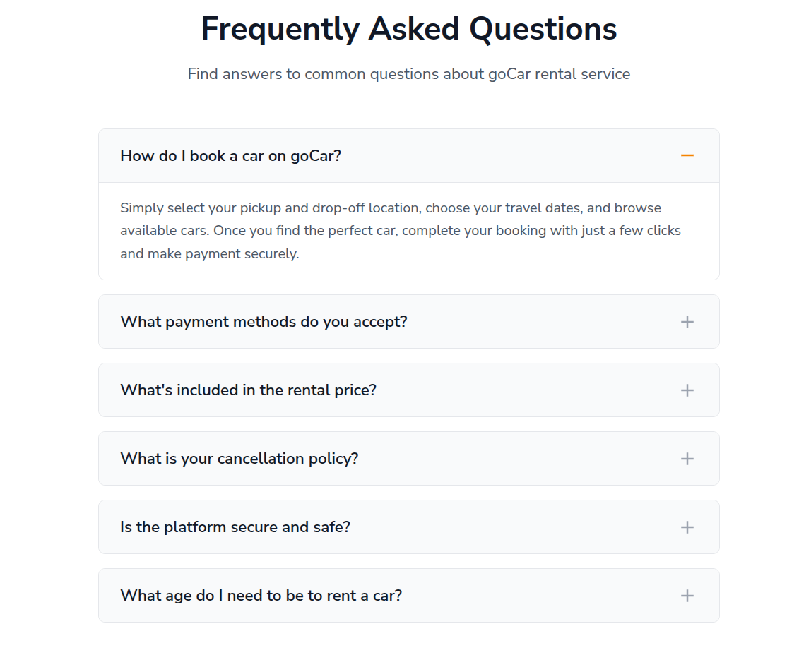 |

### Search & Browse

| Search Page | Map Selector | 
|---|---|
| 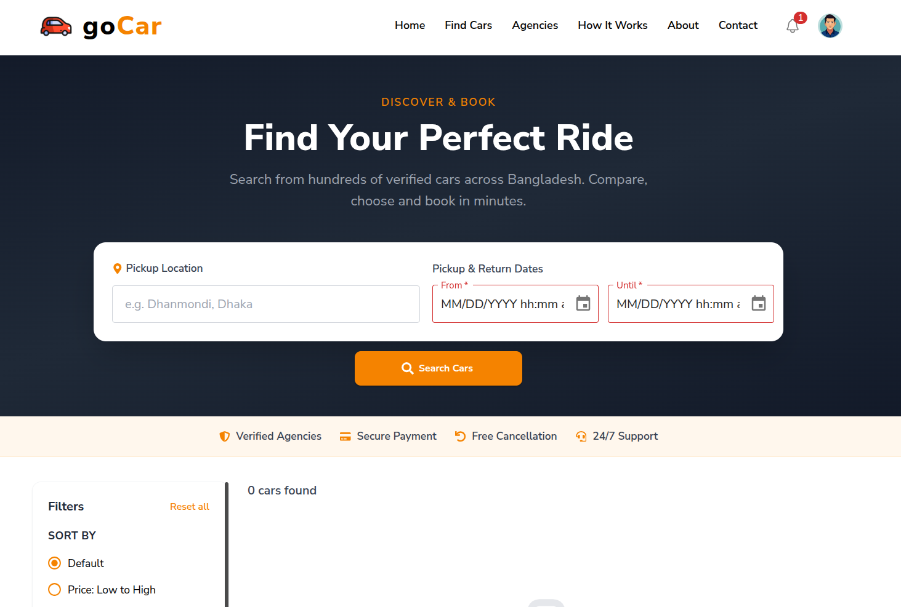 | 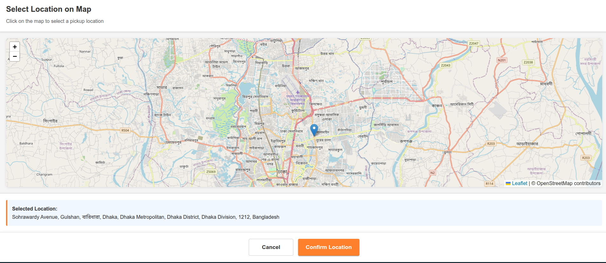 |

| Search Result | Car Details |
|---|---|
| 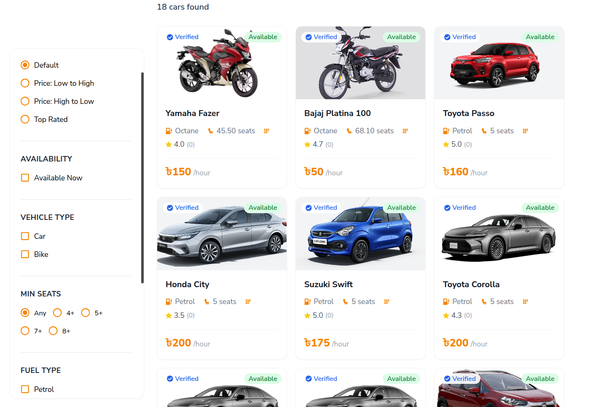 | 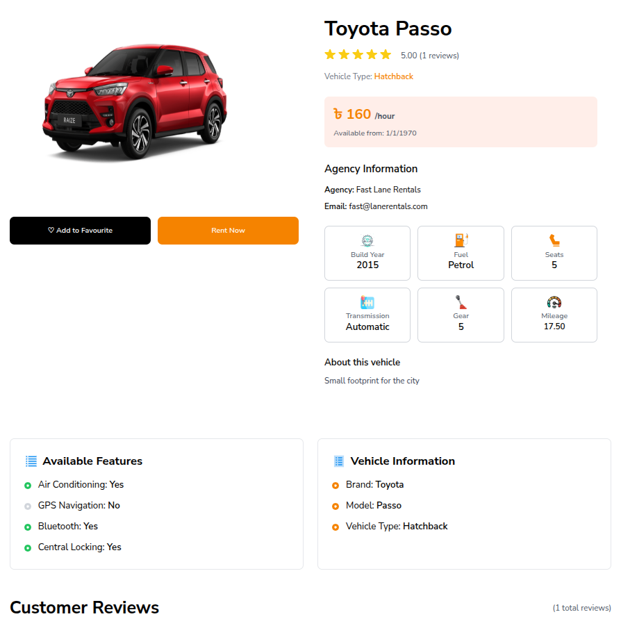 |

### Booking Flow

| Booking Details | Agency Confirmation |
|---|---|
| 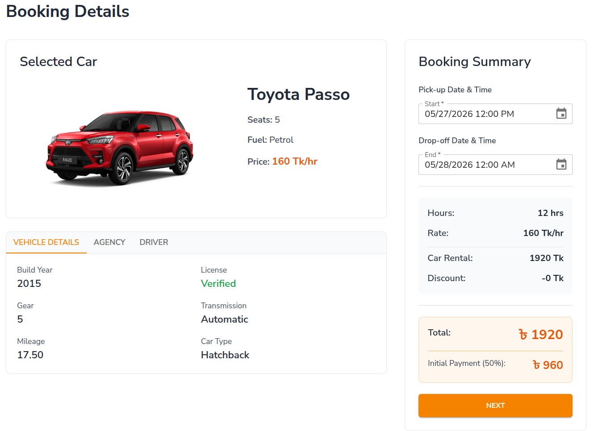 | 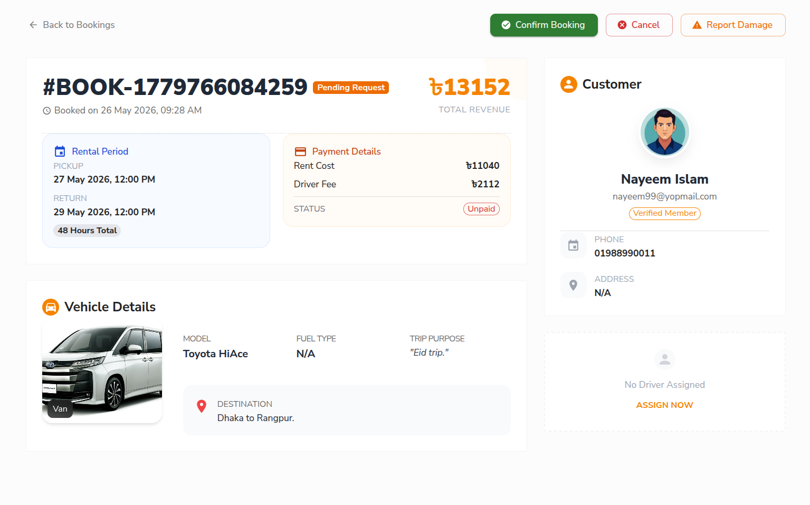 |

| User Email Confirmation | Initial Payment (50%) |
|---|---|
| 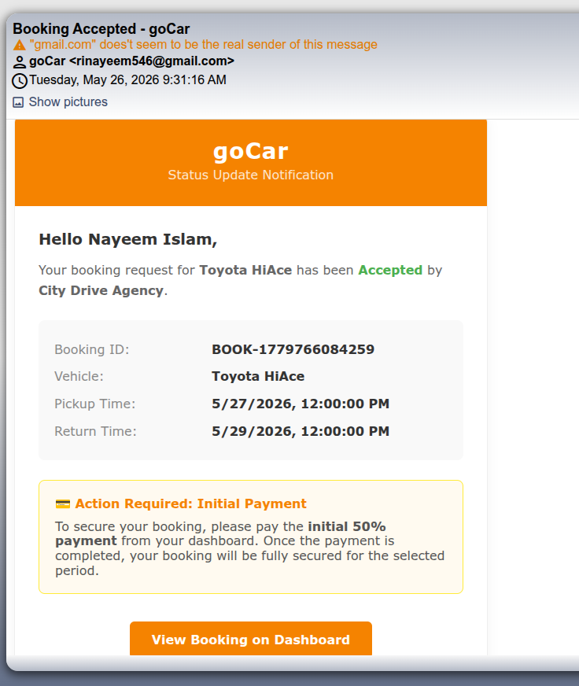 | 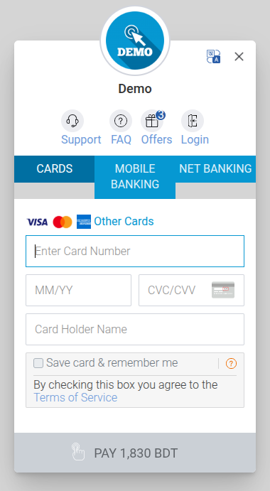 |

| Pickup Details | Return Details |
|---|---|
| 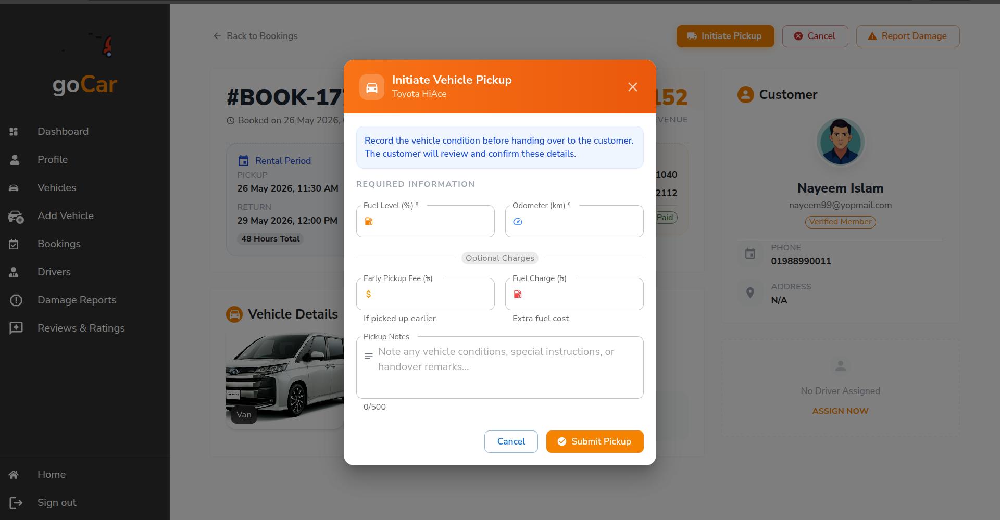 | 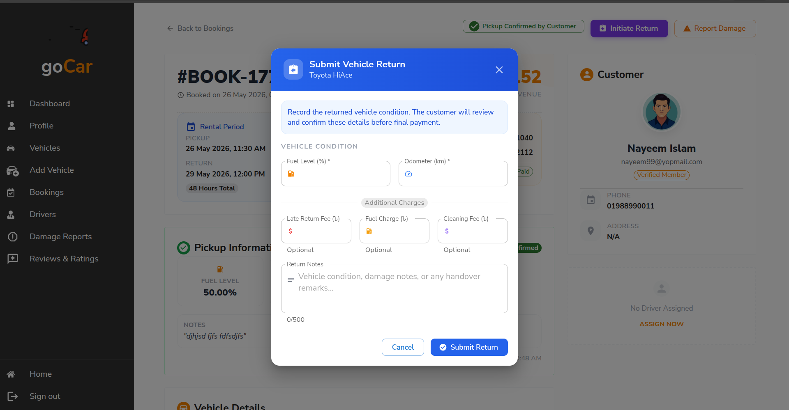 |

| Damage Report (If any during the trip) | Final Payment |
|---|---|
| 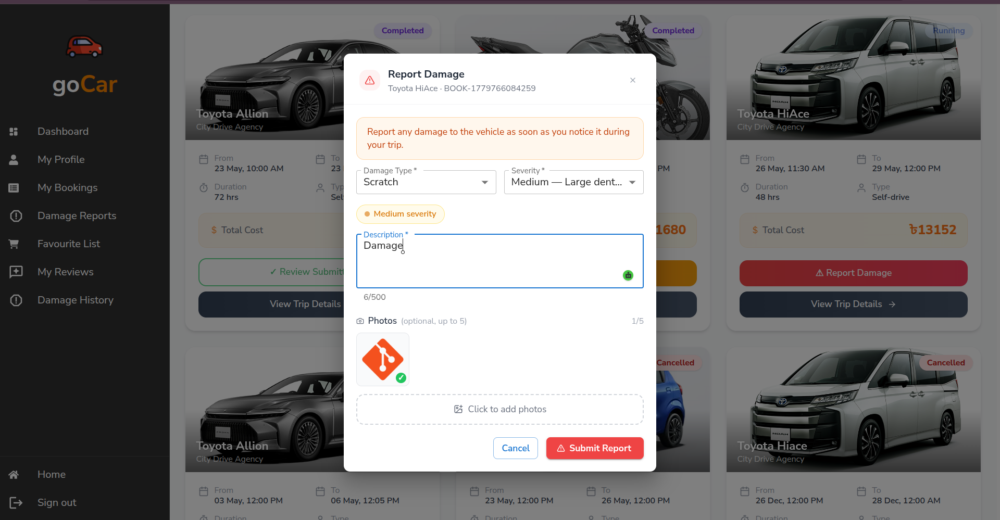 | 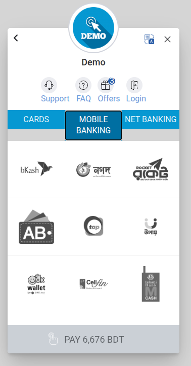 |

| User Review |
|---|
| 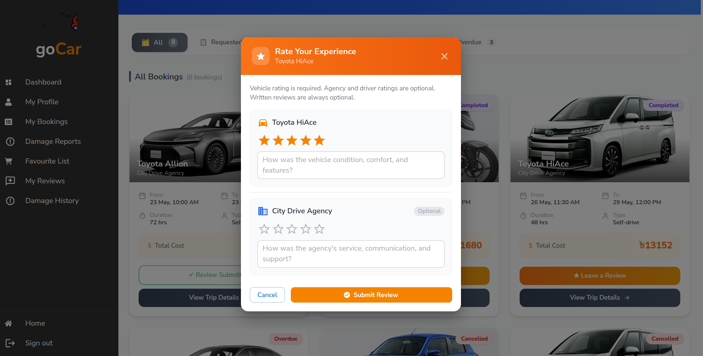 |