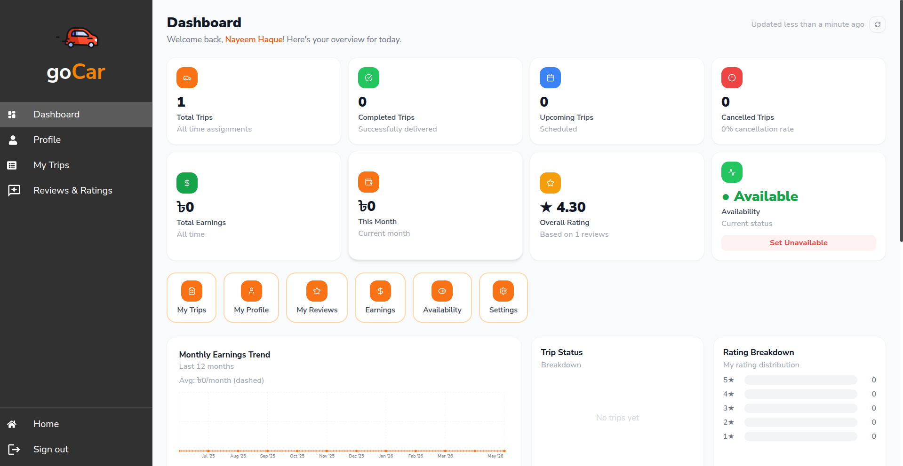
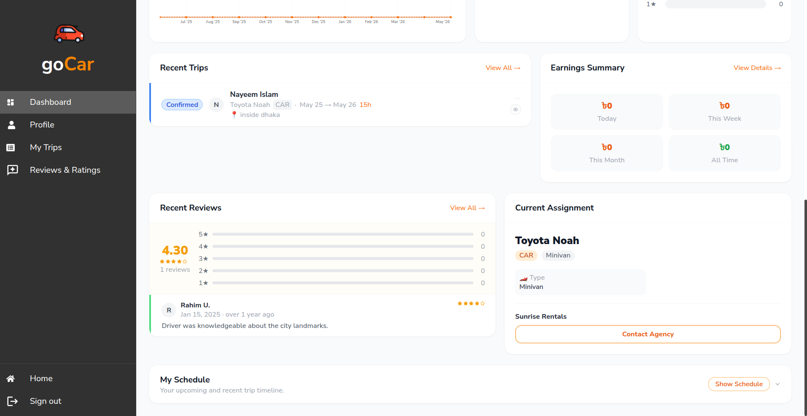
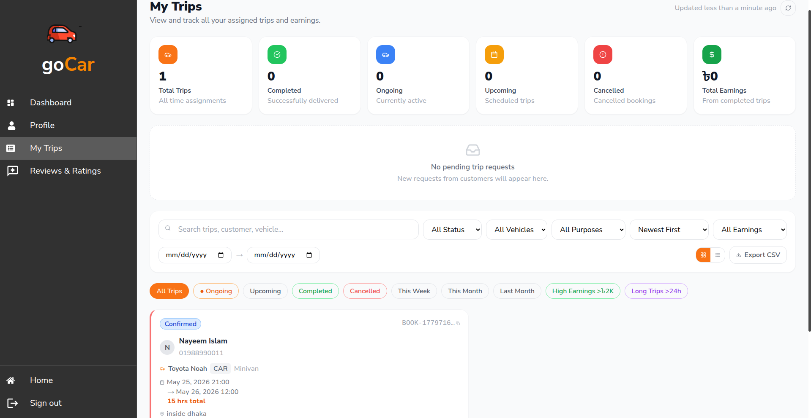
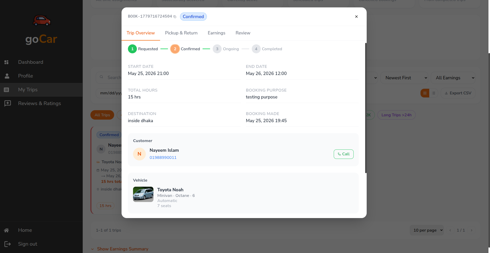
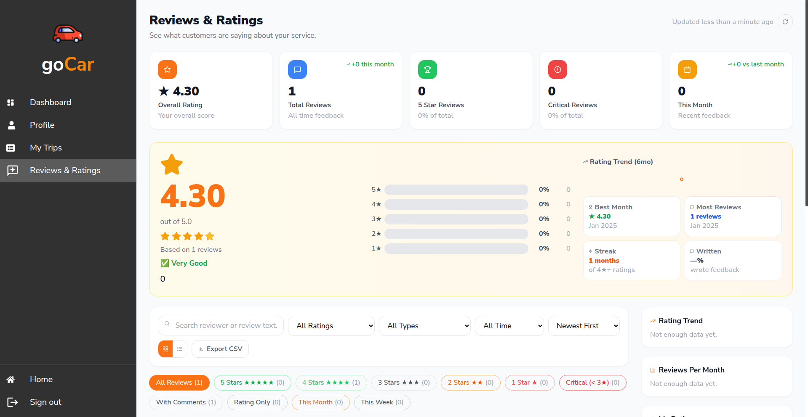
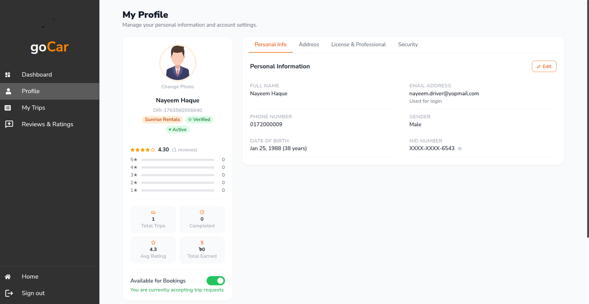

# GoCar — Driver Role

Documentation for the **Driver** role. Drivers are professionals registered under agencies who are assigned to customer bookings.

---

## Table of Contents

- [Overview](#overview)
- [Routes](#routes)
- [Features](#features)
  - [Sign Up](#sign-up)
  - [Dashboard](#dashboard)
  - [Trip Management](#trip-management)
  - [Pickup Operations](#pickup-operations)
  - [Return Operations](#return-operations)
  - [Reviews](#reviews)
  - [Profile Management](#profile-management)
  - [Notifications & Chat](#notifications--chat)
- [Screenshots](#screenshots)

---

## Overview

Drivers are registered by an agency and assigned to bookings where a customer has requested a driver. From their dashboard, drivers can view pending trip requests, accept or decline assignments, record vehicle condition at pickup and return, and monitor their trip history and earnings.

---

## Routes

### Sign Up

| Path | Step |
|---|---|
| `/sign-up/driver` | Start driver registration |
| `/sign-up/driver/email-verification` | Verify email |
| `/sign-up/driver/personal-info` | Personal details (name, NID, date of birth) |
| `/sign-up/driver/driving-info` | License info, experience, rental price |
| `/sign-up/driver/photo-upload` | Profile photo |
| `/sign-up/driver/information-review` | Review & submit |

### Driver Dashboard (login required)

| Path | Page |
|---|---|
| `/dashboard/driver` | Dashboard home |
| `/dashboard/driver/profile` | Driver profile |
| `/dashboard/driver/trips` | Trip history & active trips |
| `/dashboard/driver/trips/:id` | Trip detail |
| `/dashboard/driver/trips/:id/pickup` | Pickup condition form |
| `/dashboard/driver/trips/:id/return` | Return condition form |
| `/dashboard/driver/reviews` | Reviews received |
| `/dashboard/notifications` | Notification centre |
| `/dashboard/chat` | In-app messaging |

---

## Features

### Sign Up

Multi-step driver registration (typically initiated by an agency, but also self-service):

1. Enter email address
2. Email verification
3. Personal info (name, NID, date of birth, gender)
4. Driving info (license number, license type, years of experience, daily rental rate)
5. Upload profile photo and license scan
6. Review and submit — requires agency approval and admin verification

Unique field checks are performed at each step:
- NID (`GET /api/driverRoutes/checkNID/:nid`)
- Phone number (`GET /api/driverRoutes/checkPhone/:phone`)
- License number (`GET /api/driverRoutes/checkLicense/:license_number`)

---

### Dashboard

The driver dashboard home (`/dashboard/driver`) shows:

- **Active trip** — current assignment with user name, vehicle, and pickup details
- **Pending requests** — trip requests awaiting acceptance
- **Stats banners** — total trips completed, earnings this month, rating
- **Upcoming trips** — confirmed bookings scheduled ahead

---

### Trip Management

From `/dashboard/driver/trips`:

- **Pending requests** — accept or decline incoming trip assignments
- **Confirmed trips** — upcoming accepted trips
- **Ongoing trips** — currently active trips
- **Completed trips** — full trip history

Each trip card shows the booking dates, vehicle, pickup location, and customer name. Clicking opens the full trip detail at `/dashboard/driver/trips/:id`.

**Trip detail includes:**
- Customer info and contact
- Vehicle specs and photos
- Pickup and drop-off locations (map)
- Booking timeline
- Payment summary (driver's earning)
- Damage report status (if any)

---

### Pickup Operations

At `/dashboard/driver/trips/:id/pickup`:

Before handing the vehicle to the customer, the driver records the initial vehicle condition:

- **Fuel level** at departure
- **Odometer** reading
- **Condition notes**
- **Photos** of the vehicle (exterior, interior)
- Any **pre-existing damage** noted

The customer then confirms the pickup form from their dashboard. Once confirmed, the trip status moves to **ongoing**.

---

### Return Operations

At `/dashboard/driver/trips/:id/return`:

When the customer returns the vehicle, the driver records the return condition:

- **Fuel level** at return (calculates fuel charge if below agreed level)
- **Odometer** reading (calculates any excess mileage charge)
- **Condition notes**
- **Photos** of return condition
- **Late return** time (calculates late fee if applicable)

The customer confirms the return form. Once confirmed, the booking moves to **completed** and a final invoice is generated.

---

### Reviews

From `/dashboard/driver/reviews`:

- View all reviews left by customers
- Aggregate rating breakdown (1–5 stars)
- Written review content per booking
- Filter by date or rating

Reviews are submitted by users after a completed booking.

---

### Profile Management

From `/dashboard/driver/profile`:

- **Personal info** — name, photo, date of birth, gender, phone
- **Address** — home address with map
- **Driving license** — license number, type, expiry date; upload scan
- **Experience** — years of experience, specialisations
- **Availability status** — toggle available / unavailable (affects booking assignment)
- **Account deactivation** — soft-delete the account

---

### Notifications & Chat

- Notification feed at `/dashboard/notifications` for new trip assignments, status changes, and messages
- In-app SendBird messaging at `/dashboard/chat` — communicate with the booking user or agency coordinator per trip

---

## Screenshots

### Dashboard Home

|  |  |
|---|---|

---

### Trip List

| All Trips | Trip Detail |
|---|---|
|  |  |

---

### Reviews

---

### Profile

