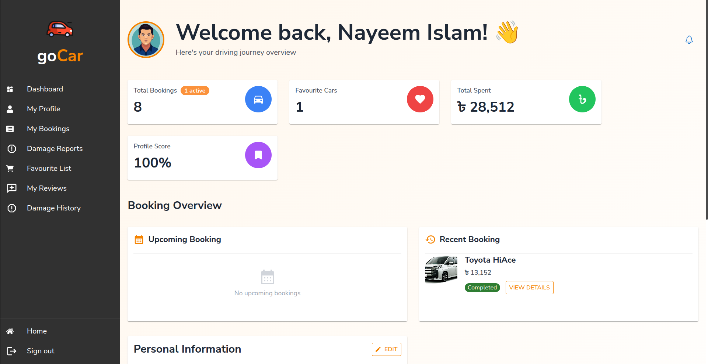
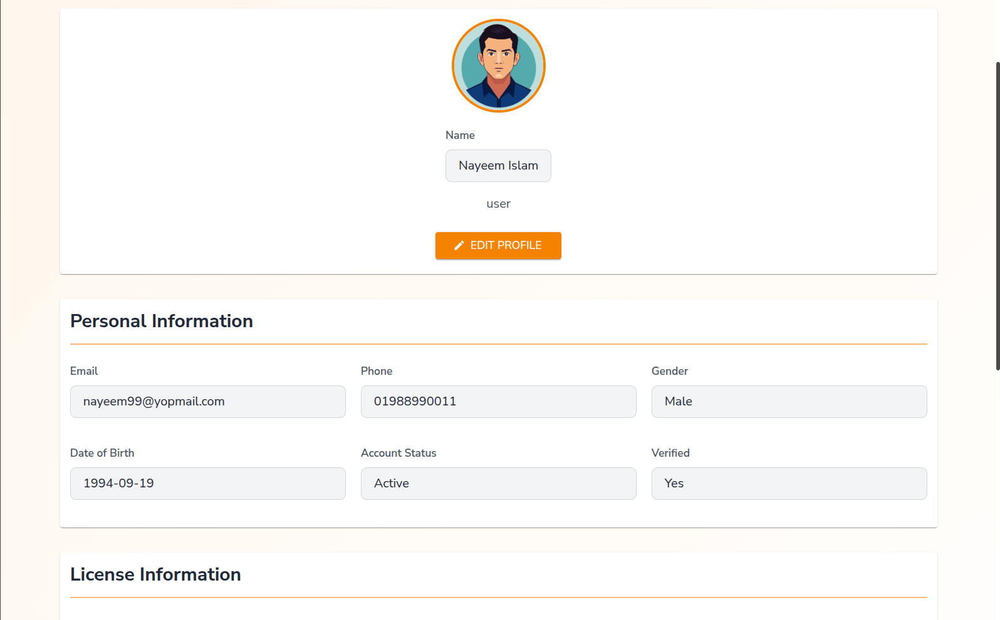

# GoCar — User Role

Documentation for the **User** role. Users are customers who browse, book, and manage vehicle rentals.

---

## Table of Contents

- [Overview](#overview)
- [Routes](#routes)
- [Features](#features)
  - [Sign Up](#sign-up)
  - [Browse & Search](#browse--search)
  - [Favourites](#favourites)
  - [Booking](#booking)
  - [Payments](#payments)
  - [Damage Reports](#damage-reports)
  - [Reviews](#reviews)
  - [Profile](#profile)
  - [Notifications](#notifications)
- [Screenshots](#screenshots)

---

## Overview

Users are the primary customers of GoCar. After registering, they can search for available cars by location and dates, book vehicles (with or without a driver), make payments, and manage their rental history — all from a personal dashboard.

---

## Routes

### Public (no login required)

| Path | Page |
|---|---|
| `/` | Home page |
| `/search` | Browse all cars |
| `/search/queries` | Filtered search results |
| `/search/map-select` | Map-based location selector |
| `/view-all-brands` | All car brands |
| `/brand/:brandName` | Cars by brand |
| `/carType/:type` | Cars by type |
| `/details/:name` | Car detail page |
| `/agencies` | All agencies |
| `/agency/:id` | Agency detail page |
| `/how-it-works` | Platform guide |
| `/about` | About GoCar |
| `/contact` | Contact form |
| `/booking-info` | Booking summary |
| `/booking-success` | Booking confirmed |
| `/payment/successful/:tran_id` | Payment success |
| `/payment/failed` | Payment failed |

### Sign Up

| Path | Step |
|---|---|
| `/sign-up` | Email entry |
| `/sign-up/email-verification` | Verify email |
| `/sign-up/user-info` | Personal information |
| `/sign-up/user-contact-info` | Contact details |
| `/sign-up/user-photo-upload` | Profile photo |
| `/sign-up/user-info-review` | Review & submit |

### User Dashboard (login required)

| Path | Page |
|---|---|
| `/dashboard/user` | Dashboard home |
| `/dashboard/user/myprofile` | Profile management |
| `/dashboard/user/my-bookings` | Booking history |
| `/dashboard/user/bookings/:id` | Booking detail |
| `/dashboard/user/my-cart` | Favourite cars |
| `/dashboard/user/my-damage-reports` | My damage reports |
| `/dashboard/user/damage-history` | Damage incident history |
| `/dashboard/user/my-reviews` | Reviews I've written |
| `/dashboard/user/reviews/new` | Submit a new review |
| `/dashboard/user/return-damage` | Pickup / return operations |
| `/dashboard/report-damage` | Report damage form |
| `/dashboard/notifications` | Notification centre |
| `/dashboard/chat` | In-app messaging |

---

## Features

### Sign Up

Multi-step registration flow with email verification:

1. Enter email address
2. Verify email via OTP/link
3. Fill in personal info (name, date of birth, gender)
4. Add contact info (phone, address with map selector)
5. Upload profile photo
6. Review and confirm

State for each step is persisted in Redux (`userSignUpSlice`) so users can navigate back without losing data.

---

### Browse & Search

The search experience supports multiple discovery modes:

- **Keyword / filter search** — filter by brand, car type, transmission, fuel type, seat count, price range
- **Location-based search** — enter a city or use the interactive Leaflet map to drop a pin
- **Brand pages** — browse all cars from a specific manufacturer
- **Type pages** — browse by category (sedan, SUV, pickup, luxury, etc.)

Each car card shows the photo, price per day, rating, and agency name. Clicking opens the full detail page with specs, documentation status, reviews, and a booking button.

---

### Favourites

Users can save cars to a favourites list (the cart). From `/dashboard/user/my-cart`, saved cars can be quickly accessed and booked.

- Add from any car card or detail page
- Remove individually or clear all
- Persisted in the backend per user

---

### Booking

The booking flow from the car detail page:

1. Select pickup and return dates/times
2. Choose pickup location (map)
3. Optionally select a driver from the agency's available drivers
4. Review booking summary (total cost, deposit)
5. Confirm booking — triggers availability check before finalising

---

### Payments

After booking confirmation, users are redirected to the SSLCommerz payment gateway:

- Supported methods: bKash, Nagad, Rocket, debit/credit card, cash
- On success: redirected to `/payment/successful/:tran_id`
- On failure: redirected to `/payment/failed`

Payment receipts can be downloaded as PDF from the booking detail page.

---

### Damage Reports

Users can submit damage reports before or after a trip:

- Upload photos as evidence
- Select severity (minor / moderate / severe)
- Describe the damage
- Track report status from `/dashboard/user/my-damage-reports`

During a trip, the user confirms the pickup condition recorded by the agency/driver, and similarly confirms the return condition at drop-off.

---

### Reviews

After a completed booking, users can submit reviews for:

- The **vehicle** (rating + written review)
- The **driver** (if one was assigned)
- The **agency**

Reviews are accessible from `/dashboard/user/my-reviews` and can be submitted via the booking detail page or `/dashboard/user/reviews/new`.

---

### Profile

Manage all personal details from `/dashboard/user/myprofile`:

- **Personal info** — name, date of birth, gender
- **Contact info** — phone number
- **Address** — searchable with map
- **Profile photo** — upload or replace
- **Driving license** — upload and track verification status

---

### Notifications

Real-time notification feed at `/dashboard/notifications` and in the top navbar via `NotificationMenu`. Notifications are sent for:

- Booking confirmations and status changes
- Payment receipts
- Damage report updates
- Review replies

---

## Screenshots

### Dashboard Home

---

### Browse & Search

| Search Page | Map Location Selector |
|---|---|
|  |  |

---

### Car Detail Page

---

### Booking Flow

| Date Selection | Driver Selection | Summary |
|---|---|---|
|  |  |  |

---

### Payment

| Payment Gateway | Success Page |
|---|---|
|  |  |

---

### My Bookings

| Booking List | Booking Detail |
|---|---|
|  |  |

---

### Favourites

---

### Damage Report

---

### Reviews

| My Reviews | Submit Review |
|---|---|
|  |  |

---

### Profile

---

> Replace placeholder paths with actual screenshots once captured.
